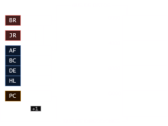
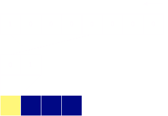
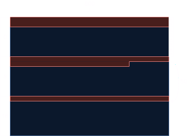

+++
title = "Dominando Ensamblador del Z80"
date = 2024-12-08
+++

*videos*

Nivel 1: [Teoría](https://youtube.com/playlist?list=PLmxqg54iaXrhybiaiiRlh2s6IqFp6s3vY&si=Vc9dtTTI3Qder67N), [Práctica](https://youtube.com/playlist?list=PLmxqg54iaXricAK8YNxIbAAErhUaq5m7m&si=-jpwFapOx_3Fewr1);

Nivel 2: [Teoría](), [Práctica]();

Nivel 3: [Teoría](), [Práctica]();

---

*1t001, 1t007*

## Ciclo de ejecución de la CPU



Fetch - Decode - Execute

RAM: FFFF = 65536 b

## Instrucciones de z80

https://clrhome.org/table/

### Las que usaremos en este nivel



<table><thead></thead>
<tbody>
  <tr>
    <th>Instrucción</th>
    <th>Operandos</th>
  </tr>
  <tr>
    <td>3E</td>
    <td>00</td>
  </tr>
  <tr>
    <td colspan="2">Ensamblador</td>
  </tr>
  <tr>
    <td colspan="2">ld a, 00</td>
  </tr>
</tbody>
</table>

<table><thead></thead>
<tbody>
  <tr>
    <th>Instrucción</th>
    <th>Operandos</th>
  </tr>
  <tr>
    <td>32<br></td>
    <td>00FF</td>
  </tr>
  <tr>
    <td colspan="2">Ensamblador</td>
  </tr>
  <tr>
    <td colspan="2">ld (FF00), a</td>
  </tr>
</tbody>
</table>



---

*1t002, 1t003*

## Binario y hexadecimal

El sistema binario representa la forma en que las computadoras almacenan información (bi-estables). Y el hexadecimal proporciona una forma compacta y legible de representar estos números. Cada dígito hexadecimal representa cuatro dígitos binarios (nibble).

### Conversiones

De binario a decimal - De decimal a binario

De hexadecimal a decimal - De decimal a hexadecimal

De binario a hexadecimal - De hexadecimal a binario

| Hex | Binario | Hex | Binario |
|---|---|---|---|
| 0 | 0000 | 8 | 1000 |
| 1 | 0001 | 9 | 1001 |
| 2 | 0010 | A | 1010 |
| 3 | 0011 | B | 1011 |
| 4 | 0100 | C | 1100 |
| 5 | 0101 | D | 1101 |
| 6 | 0110 | E | 1110 |
| 7 | 0111 | F | 1111 |

---

*1t004, 1t005, 1t006*

## Memoria de video

Parte de la memoria destinada a guardar la información de los píxeles en pantalla. Las imágenes están estructuradas en grupos de píxeles que el CRTC va leyendo de la memoria y enviando al monitor.

Por defecto arranca en C000 y ocupa 16000 bytes

50hz refresco, produce parpadeo (flickering)

## Formato de pixeles

Es el cómo organizamos y entendemoms la información guardada en la memoria de video.

En amstrad hay varios (2 modos).

### Modo 1


Hay colores que siempre modifican el mismo lado de cada par de nibbles.



## Distribución de memoria de video

Antiguamente, las computadoras trataban de emular terminales, y para ello usaban ¨caracteres¨, que son dibujos pequeños que sirven para expresar letras seguidas unas de otras.



<table><thead>
  <tr>
    <th>Unidad</th>
    <th>Ancho</th>
    <th>Alto</th>
  </tr></thead>
<tbody>
  <tr>
    <td>Caracteres</td>
    <td>40</td>
    <td>25</td>
  </tr>
  <tr>
    <td>Pixeles</td>
    <td>320</td>
    <td>200</td>
  </tr>
</tbody>
</table>



Cada caracter tiene ocho pixeles por lado.

···

La pantalla posee dos dimensiones, mientras que la memoria solamente una 

Al llenar la memoria



···

Mapa de memoria de video



<table><thead>
  <tr>
    <th></th>
    <th>0</th>
    <th>1</th>
    <th>2<br></th>
    <th>3</th>
    <th>4</th>
    <th>5</th>
    <th>6</th>
    <th>7</th>
  </tr></thead>
<tbody>
  <tr>
    <th>0<br></th>
    <td>C000</td>
    <td>C800</td>
    <td>D000</td>
    <td>D800</td>
    <td>E000</td>
    <td>E800</td>
    <td>F000</td>
    <td>F800</td>
  </tr>
  <tr>
    <th>8</th>
    <td>C050</td>
    <td>C850</td>
    <td>D050</td>
    <td>D850</td>
    <td>E050</td>
    <td>E850</td>
    <td>F050</td>
    <td>F850</td>
  </tr>
  <tr>
    <th>16</th>
    <td>C0A0</td>
    <td>C8A0</td>
    <td>D0A0<br></td>
    <td>D8A0</td>
    <td>E0A0</td>
    <td>E8A0</td>
    <td>F0A0</td>
    <td>F8A0</td>
  </tr>
  <tr>
    <th>24</th>
    <td>C0F0</td>
    <td>C8F0</td>
    <td>D0F0<br></td>
    <td>D8F0</td>
    <td>E0F0</td>
    <td>E8F0</td>
    <td>F0F0</td>
    <td>F8F0</td>
  </tr>
  <tr>
    <th>32</th>
    <td>C140</td>
    <td>C940</td>
    <td>D140</td>
    <td>D940</td>
    <td>E140</td>
    <td>E940</td>
    <td>F140</td>
    <td>F940</td>
  </tr>
  <tr>
    <th>40</th>
    <td>C190</td>
    <td>C990</td>
    <td>D190</td>
    <td>D990</td>
    <td>E190<br></td>
    <td>E990</td>
    <td>F190<br></td>
    <td>F990</td>
  </tr>
  <tr>
    <th>48<br></th>
    <td>C1E0</td>
    <td>C9E0</td>
    <td>D1E0</td>
    <td>D9E0</td>
    <td>E1E0</td>
    <td>E9E0</td>
    <td>F1E0</td>
    <td>F9E0</td>
  </tr>
  <tr>
    <th>56</th>
    <td>C230</td>
    <td>CA30<br></td>
    <td>D230</td>
    <td>DA30</td>
    <td>E230</td>
    <td>EA30</td>
    <td>F230<br></td>
    <td>FA30</td>
  </tr>
  <tr>
    <th>64</th>
    <td>C280</td>
    <td>CA80</td>
    <td>D280</td>
    <td>DA80</td>
    <td>E280</td>
    <td>EA80</td>
    <td>F280</td>
    <td>FA80</td>
  </tr>
  <tr>
    <th>72</th>
    <td>C2D0</td>
    <td>CAD0</td>
    <td>D2D0</td>
    <td>DAD0</td>
    <td>E2D0</td>
    <td>EAD0</td>
    <td>F2D0</td>
    <td>FAD0</td>
  </tr>
  <tr>
    <th>80</th>
    <td>C320</td>
    <td>CB20</td>
    <td>D320</td>
    <td>DB20</td>
    <td>E320</td>
    <td>EB20</td>
    <td>F320</td>
    <td>FB20</td>
  </tr>
  <tr>
    <th>88</th>
    <td>C370</td>
    <td>CB70</td>
    <td>D370</td>
    <td>DB70</td>
    <td>E370</td>
    <td>EB70</td>
    <td>F370</td>
    <td>FB70</td>
  </tr>
  <tr>
    <th>96</th>
    <td>C3C0</td>
    <td>CBC0</td>
    <td>D3C0</td>
    <td>DBC0</td>
    <td>E3C0</td>
    <td>EBC0</td>
    <td>F3C0</td>
    <td>FBC0</td>
  </tr>
  <tr>
    <th>104</th>
    <td>C410</td>
    <td>CC10</td>
    <td>D410</td>
    <td>DC10</td>
    <td>E410</td>
    <td>EC10</td>
    <td>F410</td>
    <td>FC10</td>
  </tr>
  <tr>
    <th>112</th>
    <td>C460</td>
    <td>CC60</td>
    <td>D460</td>
    <td>DC60</td>
    <td>E460</td>
    <td>EC60</td>
    <td>F460</td>
    <td>FC60</td>
  </tr>
  <tr>
    <th>120</th>
    <td>C480</td>
    <td>CCB0</td>
    <td>D480</td>
    <td>DCB0</td>
    <td>E480</td>
    <td>ECB0</td>
    <td>F480</td>
    <td>FCB0</td>
  </tr>
  <tr>
    <th>128</th>
    <td>C500</td>
    <td>CD00</td>
    <td>D500</td>
    <td>DD00</td>
    <td>E500</td>
    <td>ED00</td>
    <td>F500</td>
    <td>FD00</td>
  </tr>
  <tr>
    <th>136</th>
    <td>C550</td>
    <td>CD50</td>
    <td>D550</td>
    <td>DD50</td>
    <td>E550</td>
    <td>ED50</td>
    <td>F550</td>
    <td>FD50</td>
  </tr>
  <tr>
    <th>144</th>
    <td>C5A0</td>
    <td>CDA0</td>
    <td>D5A0</td>
    <td>DDA0</td>
    <td>E5A0</td>
    <td>EDA0</td>
    <td>F5A0</td>
    <td>FDA0</td>
  </tr>
  <tr>
    <th>152</th>
    <td>C5F0</td>
    <td>CDF0</td>
    <td>D5F0</td>
    <td>DDF0</td>
    <td>E5F0</td>
    <td>EDF0</td>
    <td>F5F0</td>
    <td>FDF0</td>
  </tr>
  <tr>
    <th>160</th>
    <td>C640</td>
    <td>CE40</td>
    <td>D640</td>
    <td>DE40</td>
    <td>E640</td>
    <td>EE40</td>
    <td>F640</td>
    <td>FE40</td>
  </tr>
  <tr>
    <th>168</th>
    <td>C690</td>
    <td>CE90</td>
    <td>D690</td>
    <td>DE90</td>
    <td>E690</td>
    <td>EE90</td>
    <td>F690</td>
    <td>FE90</td>
  </tr>
  <tr>
    <th>176</th>
    <td>C6E0</td>
    <td>CEE0</td>
    <td>D6E0</td>
    <td>DEE0</td>
    <td>E6E0</td>
    <td>EEE0</td>
    <td>F6E0</td>
    <td>FEE0</td>
  </tr>
  <tr>
    <th>184</th>
    <td>C730</td>
    <td>CF30</td>
    <td>D730</td>
    <td>DF30</td>
    <td>E730</td>
    <td>EF30</td>
    <td>F730</td>
    <td>FF30</td>
  </tr>
  <tr>
    <th>192</th>
    <td>C780</td>
    <td>CF80</td>
    <td>D780</td>
    <td>DF80</td>
    <td>E780</td>
    <td>EF80</td>
    <td>F780</td>
    <td>FF80</td>
  </tr>
  <tr>
    <th>Sp-S<br></th>
    <td>C7D0<br></td>
    <td>CFD0</td>
    <td>D7D0</td>
    <td>DFD0</td>
    <td>E7D0</td>
    <td>EFD0</td>
    <td>F7D0</td>
    <td>FFD0</td>
  </tr>
  <tr>
    <th>Sp-E</th>
    <td>C7FF</td>
    <td>CFFF</td>
    <td>D7FF</td>
    <td>DFFF</td>
    <td>E7FF</td>
    <td>EFFF</td>
    <td>F7FF</td>
    <td>FFFF</td>
  </tr>
</tbody></table>



- Cada fila de pixeles ocupa 2k = 2048 dec = 800 hex

---


### **RETO**: Pintar un pixel rojo

![[h3.jpg]]

```
3E 88 32 00 C0 18 FE
```

### De 2 en 2

![[h3.jpg]]

```
21 8888
22 00C0
18 FE
```

### **RETO**: Domina el formato

![[h3.jpg]]

4px rojos

```
3E FF 32 00 C0 18 FE
```

24px, x4 grupos mismo color, rojo cyan amarillo, 21 bonus

```
21 FF F0 22 00 C0 21 0F F0 22 02 C0 21 0F FF 22 04 C0 18 FE

Disassembly curiousity

FF F0 0F F0 0F FF
```

lo mismo que la anterior en grupos de 2px (12 total), 3e 21 bonus

```
3E F3 32 00 C0 21 C3 CF 22 01 C0 18 FE

F3 C3 CF
```

8px, cada uno junto de color distinto

```
21 BC 5B 22 00 C0 18 FE

BC 5B
```

80px dibujo libre, todos los colores

```
21 FF 7F 22 00 C0 21 3F 1F 22 02 C0
21 0F 87 22 04 C0 21 C3 E1 22 06 C0
21 F0 70 22 08 C0 21 30 10 22 0A C0
21 00 88 22 0C C0 21 CC EE 22 0E C0

21 FF 7F 22 10 C0 21 3F 1F 22 12 C0
21 0F 87 22 14 C0 21 C3 E1 22 16 C0
21 F0 70 22 18 C0 21 30 10 22 1A C0
21 00 88 22 1C C0 21 CC EE 22 1E C0

18 FE
```

---
